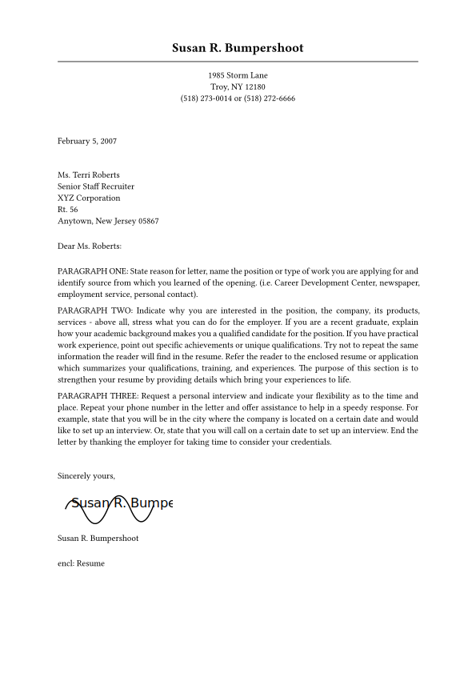

# cover-letter-typst
A Typst-native template Unofficial engineeringresumes inspired Cover Letter theme for typst 



## Installation

Two ways to install or use the package:

### Direct / per-project (works in typst.app online)

- Download `elegant-cover-letter.typ` (from this repo or package) into the same folder as your `main.typ` and import it directly:

```typst
#import "elegant-cover-letter.typ": *
```

This is the simplest option and works well when editing a single document or using the Typst web app: just upload `elegant-cover-letter.typ` alongside your `main.typ`.

### Local (global) installation — makes the package available as `@local/elegant-cover-letter:0.0.1`

Make sure to have [git installed](https://github.com/git-guides/install-git).

**Linux**

```bash
git clone "https://github.com/nithitsuki/elegant-cover-letter-typst.git" "${XDG_DATA_HOME:-$HOME/.local/share}/typst/packages/local/elegant-cover-letter/0.0.1"
```

**macOS**

```bash
git clone "https://github.com/nithitsuki/elegant-cover-letter-typst.git" ~/Library/Application/typst/packages/local/elegant-cover-letter/0.0.1
```

**Windows (PowerShell)**

```powershell
git clone "https://github.com/nithitsuki/elegant-cover-letter-typst.git" "$env:APPDATA/typst/packages/local/elegant-cover-letter/0.0.1"
```

## Quick start

Just copy paste the [main.typ](template/main.typ) content into your `main.typ` file and start editing!

If you have it installed locally, you can also initialize a new project with:

```bash
typst init "@local/elegant-cover-letter:0.0.1"
```
